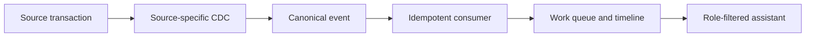

# Northstar Care Coordination

Northstar is a runnable teaching demo of the path from a role-specific source write through CDC capture, a normalized event, an idempotent projection, a work queue, and a constrained administrative assistant.

> **Synthetic training data — not for clinical use.** This is not a clinical system, medical advice, or a claim of HIPAA compliance. Real deployments require independent privacy, security, legal, vendor, and governance review.

## Quick start

```bash
pip install -e '.[dev]'
uvicorn app.main:app --reload
```

Open `http://127.0.0.1:8000`. The default SQLite and `simulated` CDC mode need no Docker, database, Kafka, MCP server, or AI API key. Reset predictable seed data with `python scripts/reset_demo.py`; run tests with `pytest`.

Explore [.env.example](.env.example) for model and app options

## Demo controls

Use Reception, Nurse Queue, and Doctor & PA to produce source changes. Diagnostics exposes raw → canonical → projection traces, pause/resume, process, duplicate delivery, and DLQ replay. `CDC_AUTO_PROCESS=false` makes the pending state visible. The assistant is deterministic and read-only; it shows exact facts used and freshness.

`CDC_MODE=sqlserver` and `CDC_MODE=postgres_debezium` are course-exercise fixture/ingestion adapters, not production connector claims. Submit records to `POST /api/ingest/sqlserver-cdc` and `POST /api/ingest/debezium` as the admin demo persona.




| Directory | Role |
| --- | --- |
| `cdc/` | Source adapters, normalization, consumer, and dead-letter handling |
| `services/` | Workflows, authorization, projections, diagnostics, and assistant policy |
| `ai/` | Deterministic assistant, context store, and optional provider adapter |
| `mcp/` | Local, in-process, read-only MCP-style gateway and client |
| `templates/`, `static/` | Role-specific web UI |

Shared seed/reset/replay commands live in [`scripts/`](../scripts/).
Database and capture infrastructure lives in [`docker/`](../docker/README.md).
