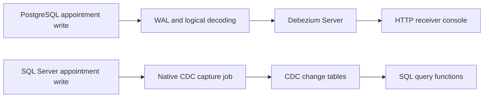

# PostgreSQL and SQL Server capture labs

This stack provides two independent paths. Docker Compose is the prerequisite.



PostgreSQL uses Debezium to read logical changes and deliver HTTP events. Its
initial snapshot emits `r` records, followed by `c`, `u`, and `d` streaming records.
SQL Server uses Agent capture and cleanup jobs. Read its CDC tables through the
native query functions; updates have before and after row images.

## Start and observe

Run commands from the repository root. Define this shortcut in each terminal:

```bash
dc() { docker compose -f docker/database-capture/compose.yaml "$@"; }
```

Both database services are seeded with the same Northstar source tables and
records as the app's [`seed.py`](../../app/seed.py). The
[SQL Server walkthrough](../../exercises/02-sqlserver/README.md) uses
`NorthstarSource.dbo.appointments`. The
[PostgreSQL walkthrough](../../exercises/03-postgres/README.md) uses
`northstar_cdc_lab.public.appointments` in this stack on host port `15432`.

To run the complete stack (SQL Server + PostgreSQL + receiver + Debezium):

```bash
dc up -d --build postgres sqlserver cdc-receiver debezium
dc run --rm sqlserver-init
dc ps
```

Use this path when you want both capture labs available in one environment.
`sqlserver-init` runs once to seed and enable SQL Server CDC.
`postgres-init` runs before Debezium and adds the Northstar seed if an existing
PostgreSQL volume still has only the older `customers` lab. It preserves existing
tables and skips seeding when `appointments` already exists. Both init services
should exit successfully; Debezium should remain running and healthy for PostgreSQL.

For SQL Server only:

```bash
dc up -d sqlserver
dc run --rm sqlserver-init
dc ps
```

Initialization runs in the foreground and seeds `NorthstarSource`, then enables
CDC for its appointments table.
Follow the [session 2 walkthrough](../../exercises/02-sqlserver/README.md) for
inline SQL, connection details, and capture-job investigation.
The SQL Server container image does not enable CDC on databases or tables by
itself. `MSSQL_AGENT_ENABLED=true` starts SQL Server Agent; the `sqlserver-init`
service runs `sys.sp_cdc_enable_db` and `sys.sp_cdc_enable_table`.
If initialization repeatedly prints `Waiting for SQL Server...`, inspect the
database container before rerunning the initializer:

```bash
dc ps sqlserver
dc logs --tail=100 sqlserver
```

The init service connects inside the Compose network to `tcp:sqlserver,1433`.
Host tools such as VS Code or SSMS connect through the published port
`localhost,1435`.

For the PostgreSQL appointments demonstration:

```bash
dc up -d --build postgres cdc-receiver debezium
dc ps -a
dc logs --tail=100 debezium cdc-receiver
```

Wait for Debezium to become healthy and for the receiver logs to show ten
snapshot events with `op = "r"` and `source.table = "appointments"` on a fresh
Northstar capture. Open `dc logs -f cdc-receiver` in a second terminal to observe
later changes. The connector uses the seeded `debezium` login, the
`northstar_publication` publication, and the `northstar_http_slot` slot.
Its `northstar` source prefix keeps appointment offsets separate from the older
Northstar connector. Normal restarts resume from these saved offsets.
If Debezium is stopped or unhealthy, follow [Troubleshooting](#troubleshooting).

In another terminal, connect and run the statements in the
[PostgreSQL exercise](../../exercises/03-postgres/README.md):

    dc exec postgres psql -U postgres -d northstar_cdc_lab

Inspect the CDC infrastructure:

    dc exec postgres psql -U postgres -d northstar_cdc_lab -c "SELECT * FROM pg_publication; SELECT * FROM pg_publication_tables; SELECT slot_name, plugin, slot_type, database, active, restart_lsn, confirmed_flush_lsn FROM pg_replication_slots; SELECT pg_current_wal_lsn(); SHOW wal_level; SHOW max_replication_slots; SHOW max_wal_senders;"

For SQL Server, open the [session 2 walkthrough](../../exercises/02-sqlserver/README.md#1-connect-to-the-container-database).
It connects through the SQL Server (mssql) VS Code extension at `localhost,1435`, then walks through the appointments
mutations, native CDC queries, capture jobs, and cleanup without a separate SQL file.

## Concepts

- WAL is PostgreSQL's durable write-ahead change log.
- wal_level=logical preserves information required for logical decoding.
- Logical decoding converts WAL into a client-readable change stream.
- pgoutput is PostgreSQL's built-in logical decoding output plugin.
- A publication selects exposed tables (public.appointments).
- A replication slot retains the stream position and prevents needed WAL recycling. Debezium creates northstar_http_slot; the initializer creates the publication but not the slot.
- An LSN is a position in WAL. confirmed_flush_lsn shows consumer progress.
- Debezium offsets are its durable processing position, stored in the debezium-offsets volume; they are distinct from the PostgreSQL slot.
- SQL Server CDC requires SQL Agent; this Compose file enables SQL Agent with MSSQL_AGENT_ENABLED=true.
- SQL Server CDC capture and cleanup jobs are created by sys.sp_cdc_enable_db and sys.sp_cdc_enable_table.

## State and reset

Ctrl+C and dc down preserve named volumes. dc down -v deliberately removes PostgreSQL/SQL Server data and Debezium offsets:

    dc down
    dc down -v
    dc up -d --build

PostgreSQL maps to host port 15432, but containers use postgres:5432. Connect as
`postgres` with password `postgres-lab-only` to database `northstar_cdc_lab`.
SQL Server maps to host port 1435, but containers use sqlserver:1433. The receiver
maps to host port 3000; the PostgreSQL Debezium service uses
http://cdc-receiver:3000/events. SQL Server has no receiver or Debezium dependency.

## Troubleshooting

### Debezium stopped or unhealthy

For the PostgreSQL path, Debezium must stay running. An exited connector is not
evidence of successful capture, even when its exit code is zero. Inspect:

```bash
dc ps -a
dc logs --tail=100 postgres-init debezium cdc-receiver
dc exec postgres psql -U postgres -d northstar_cdc_lab -c "SELECT to_regclass('public.appointments'); SELECT * FROM pg_publication_tables WHERE pubname = 'northstar_publication'; SELECT slot_name, database, active, wal_status FROM pg_replication_slots;"
```

Expect `appointments`, the Northstar publication, and an active
`northstar_http_slot`. To apply the current configuration and seed an old
customers-only volume without removing database data:

```bash
dc up -d --build postgres cdc-receiver debezium
```

The setup service runs the seed in a single transaction. If it fails, resolve the
reported SQL error and rerun this command. Existing appointments are preserved,
so this command does not restore rows changed during an exercise.

If logs report that a saved log position is no longer available, keep the
database, slot, and offset volumes intact while investigating. The older
customers connector's checkpoints are isolated by the current `northstar`
prefix. If the error affects the current Northstar stream, a new snapshot is
needed; it can restore current rows but cannot recover change history already
removed from WAL. See [Debezium snapshot recovery](https://debezium.io/documentation/reference/3.6/connectors/postgresql.html#postgresql-snapshots).
Do not use `dc down -v` as a connector repair: it removes SQL Server data too.

### Which PostgreSQL stack to use

The full [session 3 walkthrough](../../exercises/03-postgres/README.md) defines
`dc` against `docker/postgres-app-integration/compose.yaml`, uses
`northstar_cdc_lab` on host port `15432`, and journals events in its `receiver`.
This shared stack uses the same `northstar_cdc_lab` connection settings and prints
events in `cdc-receiver`. Their Docker networks, data, slots, and offsets are independent;
both can run alongside SQL Server. Start Debezium in the stack whose exercise
commands you are following.
