# SQL Server CDC: capture changes from the Docker lab

Capture appointment inserts, updates, and deletes in `NorthstarSource` using
SQL Server 2025. Assume the container is running, the database is seeded, and CDC
is enabled. The data matches the app's [seed](../../app/seed.py).
For container setup, see the [Docker stack](../../docker/database-capture/README.md).

## 1. Connect to the container database

Install the [VS Code SQL Server extension](https://marketplace.visualstudio.com/items?itemName=ms-mssql.mssql).
Open **SQL Server > Add Connection > Parameters**:

| Setting | Value |
| --- | --- |
| Server | `localhost,1435` |
| Authentication | SQL Login |
| User | `sa` |
| Password | `YourStrong!Passw0rd` (lab only) |
| Database | `NorthstarSource` |
| Trust server certificate | Yes |
| Profile | `cdc-lab` |

<details>
<summary>Connection screenshots</summary>

Use `NorthstarSource` for the database; the login screenshot shows an older name.

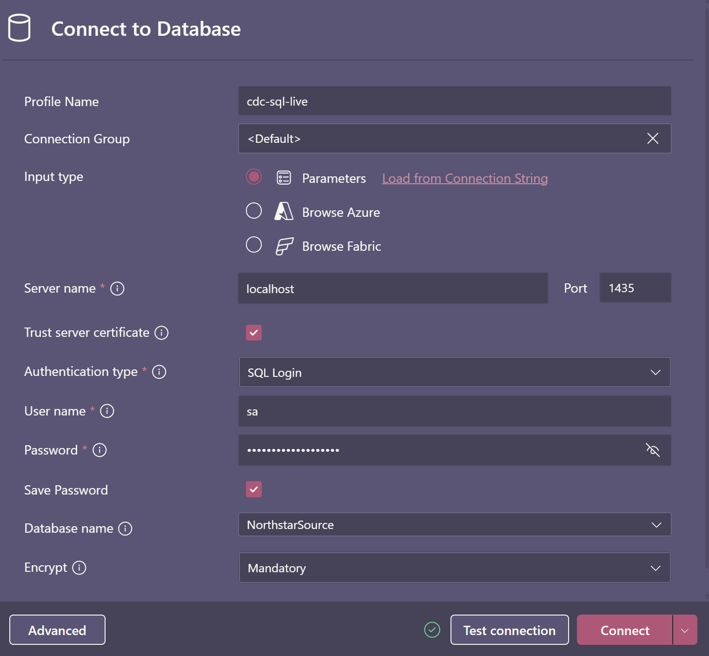

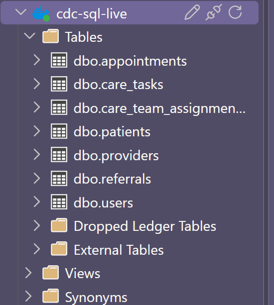

</details>

Open a SQL file, connect with **MS SQL: Connect** (`Ctrl+Alt+C`), and run each
block with **Execute Query** (`Ctrl+Shift+E`). Keep the same connection throughout:
later steps reuse [temporary tables](#fix-missing-temporary-tables). SSMS also works.

```sql
USE NorthstarSource;
GO
SET NOCOUNT ON;
SET XACT_ABORT ON;
SET IMPLICIT_TRANSACTIONS OFF;

SELECT DB_NAME() AS current_database,
       SERVERPROPERTY('ProductVersion') AS product_version,
       SERVERPROPERTY('Edition') AS edition,
       ORIGINAL_LOGIN() AS login_name,
       IS_SRVROLEMEMBER('sysadmin') AS is_sysadmin;

SELECT servicename, status_desc
FROM sys.dm_server_services
WHERE servicename LIKE N'SQL Server Agent%';
GO
```

Expect `NorthstarSource`, SQL Server 2025, login `sa`, `is_sysadmin = 1`, and Agent
status `Running`. For errors, see [Troubleshooting](#fix-host-connection-fails).

<details>
<summary>Expected connection results</summary>

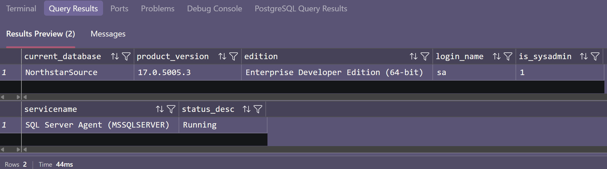

</details>

## 2. Verify the seed

```sql
SELECT patient_id, display_name, birth_year, contact_preference
FROM dbo.patients
ORDER BY patient_id;

SELECT appointment_id, patient_id, provider_id, status, reason_code
FROM dbo.appointments
ORDER BY appointment_id;
SELECT referral_id, patient_id, status
FROM dbo.referrals
ORDER BY referral_id;
SELECT task_id, patient_id, task_type, status
FROM dbo.care_tasks
ORDER BY task_id;
SELECT (SELECT COUNT(*) FROM dbo.users) AS users,
       (SELECT COUNT(*) FROM dbo.providers) AS providers,
       (SELECT COUNT(*) FROM dbo.care_team_assignments) AS assignments;
GO
```

Expect 7 users, 2 providers, 10 patients, 10 assignments, 10 appointments,
6 referrals, and 10 care tasks on a fresh volume.

[Initialization fix](#fix-initializer-exits-nonzero)

<details>
<summary>Expected seed results</summary>

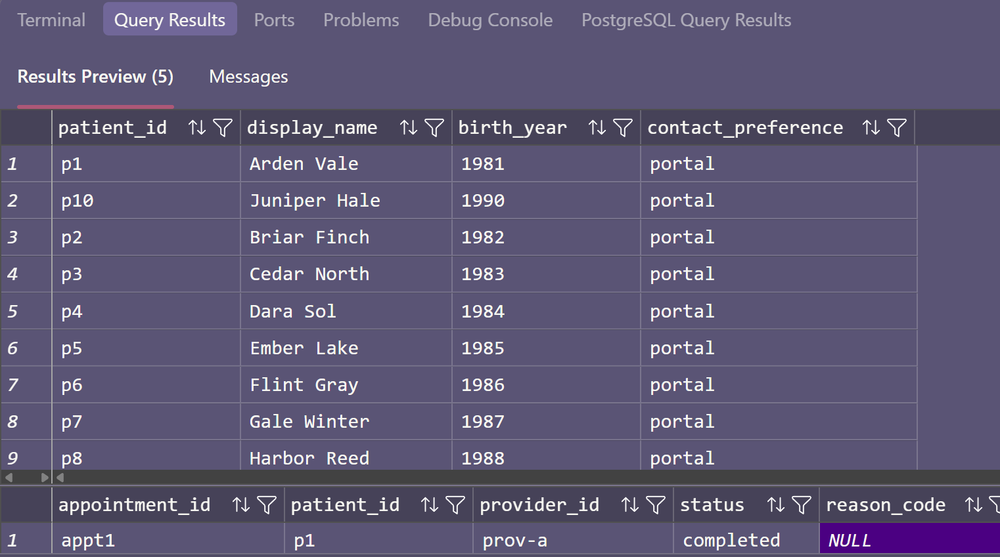

</details>

## 3. Verify CDC

```sql
SELECT name, is_cdc_enabled
FROM sys.databases WHERE database_id = DB_ID();

SELECT name, is_tracked_by_cdc
FROM sys.tables WHERE object_id = OBJECT_ID(N'dbo.appointments');

EXEC sys.sp_cdc_help_change_data_capture
    @source_schema = N'dbo', @source_name = N'appointments';
EXEC sys.sp_cdc_help_jobs;

SELECT name, type_desc
FROM sys.objects
WHERE schema_id = SCHEMA_ID(N'cdc')
ORDER BY name;
GO
```

Expect both CDC flags to be `1`, capture instance `app_appointments`, change table
`cdc.app_appointments_CT`, and capture/cleanup jobs. If missing, use
[Troubleshooting](#cdc-enablement-repair).

[Initializer exits nonzero](#fix-initializer-exits-nonzero) · [Capture job stopped](#fix-capture-job-stopped) · [Net-changes function missing](#fix-net-changes-function-missing)

<details>
<summary>Expected CDC configuration</summary>

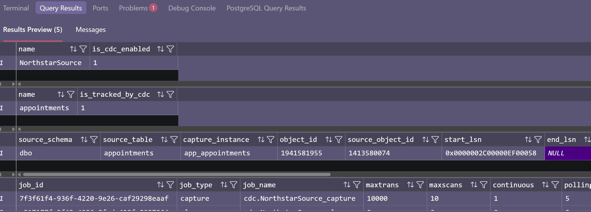

</details>

## 4. Check the starting counts

```sql
SELECT COUNT(*) AS source_rows FROM dbo.appointments;
SELECT COUNT(*) AS captured_rows FROM cdc.app_appointments_CT;
GO
```

Expect 10 source rows and 0 captured rows on a fresh database. Seeding happens
before CDC is enabled; existing rows are not copied into CDC. Reused databases
may have earlier captured changes.

<details>
<summary>Expected starting counts</summary>

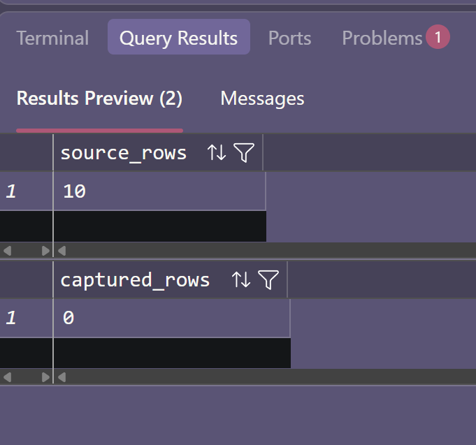

</details>

## 5. Generate committed changes

Run this block once in your SQL session. Each transaction commits independently.

```sql
DROP TABLE IF EXISTS #LabAppointment;
CREATE TABLE #LabAppointment (appointment_id nvarchar(255) NOT NULL PRIMARY KEY);

BEGIN TRANSACTION;
INSERT dbo.appointments
    (appointment_id, patient_id, provider_id, scheduled_start_at, status, reason_code, updated_at)
OUTPUT inserted.appointment_id INTO #LabAppointment
VALUES
    (N'lab-appt', N'p1', N'prov-a',
     TODATETIMEOFFSET(DATEADD(day, 1, SYSUTCDATETIME()), '+00:00'),
     N'scheduled', NULL, TODATETIMEOFFSET(SYSUTCDATETIME(), '+00:00'));
COMMIT TRANSACTION;

BEGIN TRANSACTION;
UPDATE a SET status = N'no_show'
FROM dbo.appointments AS a
JOIN #LabAppointment AS lab ON lab.appointment_id = a.appointment_id;
COMMIT TRANSACTION;

BEGIN TRANSACTION;
UPDATE a SET status = N'canceled', reason_code = N'cdc_lab_reschedule'
FROM dbo.appointments AS a
JOIN #LabAppointment AS lab ON lab.appointment_id = a.appointment_id;
COMMIT TRANSACTION;

BEGIN TRANSACTION;
DELETE a
FROM dbo.appointments AS a
JOIN #LabAppointment AS lab ON lab.appointment_id = a.appointment_id;
COMMIT TRANSACTION;

SELECT appointment_id AS this_runs_appointment_id FROM #LabAppointment;
SELECT appointment_id, patient_id, provider_id, status, reason_code
FROM dbo.appointments ORDER BY appointment_id;
GO
```

Expect the original 10 appointments. `lab-appt` has been deleted.

[Missing temporary tables](#fix-missing-temporary-tables)

<details>
<summary>Expected committed-change results</summary>

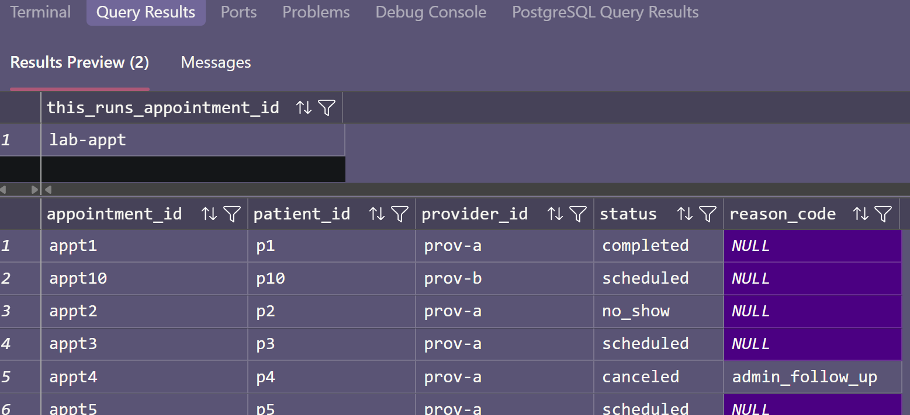

</details>

## 6. Wait for capture

Run this block to wait up to 60 seconds and save the captured changes:

```sql
DECLARE @deadline datetime2(3) = DATEADD(second, 60, SYSUTCDATETIME());
WHILE (SELECT COUNT(*) FROM cdc.app_appointments_CT AS c
       JOIN #LabAppointment AS lab ON lab.appointment_id = c.appointment_id) < 6
      AND SYSUTCDATETIME() < @deadline
BEGIN
    WAITFOR DELAY '00:00:01';
END;

IF (SELECT COUNT(*) FROM cdc.app_appointments_CT AS c
    JOIN #LabAppointment AS lab ON lab.appointment_id = c.appointment_id) <> 6
    THROW 51000, 'Expected six lab images. Inspect capture jobs and errors.', 1;
GO

DROP TABLE IF EXISTS #CdcWindow;
DROP TABLE IF EXISTS #AllChanges;
DECLARE @from_lsn binary(10) = sys.fn_cdc_get_min_lsn(N'app_appointments');
DECLARE @to_lsn binary(10) = sys.fn_cdc_get_max_lsn();
IF @from_lsn IS NULL OR @to_lsn IS NULL
   OR @from_lsn = 0x00000000000000000000 OR @from_lsn > @to_lsn
    THROW 51001, 'A valid CDC query window is not available yet.', 1;

SELECT @from_lsn AS from_lsn, @to_lsn AS to_lsn INTO #CdcWindow;
SELECT * INTO #AllChanges
FROM cdc.fn_cdc_get_all_changes_app_appointments(@from_lsn, @to_lsn, N'all update old');
SELECT * FROM #CdcWindow;
GO
```

Expect a saved LSN window. If capture times out, see
[Troubleshooting](#capture-failures).

[CDC rows never arrive](#fix-cdc-rows-never-arrive) · [Error 313](#fix-error-313) · [Missing temporary tables](#fix-missing-temporary-tables)

<details>
<summary>Expected CDC query window</summary>

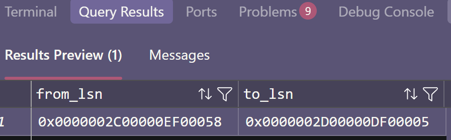

</details>

## 7. Read the changes

```sql
SELECT c.__$start_lsn AS commit_lsn, c.__$seqval AS sequence_value,
       sys.fn_cdc_map_lsn_to_time(c.__$start_lsn) AS source_commit_time,
       c.__$operation AS operation_code, c.__$update_mask AS update_mask,
       c.appointment_id, c.patient_id, c.provider_id, c.scheduled_start_at,
       c.status, c.reason_code
FROM #AllChanges AS c
JOIN #LabAppointment AS lab ON lab.appointment_id = c.appointment_id
ORDER BY c.__$start_lsn, c.__$seqval, c.__$operation;
GO
```

Expect these six images:

| Code | Status and reason | Meaning |
| --- | --- | --- |
| 2 | `scheduled`, `NULL` | Insert |
| 3 | `scheduled`, `NULL` | First update, before |
| 4 | `no_show`, `NULL` | First update, after |
| 3 | `no_show`, `NULL` | Second update, before |
| 4 | `canceled`, `cdc_lab_reschedule` | Second update, after |
| 1 | `canceled`, `cdc_lab_reschedule` | Delete |

<details>
<summary>Expected captured changes</summary>

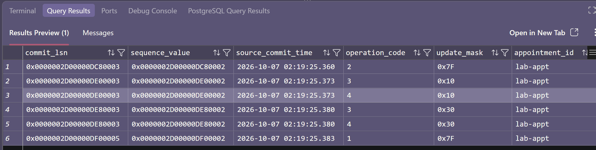

</details>

[Missing temporary tables](#fix-missing-temporary-tables)

## 8. Verify rollback

Save `appt2`'s current reason code, roll back an insert, and commit a marker update:

```sql
DROP TABLE IF EXISTS #LabMarker;
CREATE TABLE #LabMarker
(
    appointment_id nvarchar(255) NOT NULL PRIMARY KEY,
    original_reason_code nvarchar(255) NULL,
    marker_reason_code nvarchar(255) NOT NULL,
    rollback_appointment_id nvarchar(255) NULL
);
INSERT #LabMarker (appointment_id, original_reason_code, marker_reason_code)
SELECT appointment_id, reason_code,
       N'cdc-marker-' + CONVERT(nvarchar(36), NEWID())
FROM dbo.appointments WHERE appointment_id = N'appt2';
IF (SELECT COUNT(*) FROM #LabMarker) <> 1
    THROW 51002, 'Expected the seeded appt2 row. Inspect source data.', 1;

BEGIN TRANSACTION;
INSERT dbo.appointments
    (appointment_id, patient_id, provider_id, scheduled_start_at, status, reason_code, updated_at)
VALUES
    (N'rollback-appt', N'p2', N'prov-a',
     TODATETIMEOFFSET(DATEADD(day, 2, SYSUTCDATETIME()), '+00:00'),
     N'scheduled', NULL, TODATETIMEOFFSET(SYSUTCDATETIME(), '+00:00'));
SELECT * FROM dbo.appointments WHERE appointment_id = N'rollback-appt';
ROLLBACK TRANSACTION;
UPDATE #LabMarker SET rollback_appointment_id = N'rollback-appt';

UPDATE a SET reason_code = marker.marker_reason_code
FROM dbo.appointments AS a
JOIN #LabMarker AS marker ON marker.appointment_id = a.appointment_id;
GO

DECLARE @deadline datetime2(3) = DATEADD(second, 60, SYSUTCDATETIME());
WHILE NOT EXISTS
    (SELECT 1 FROM cdc.app_appointments_CT AS c JOIN #LabMarker AS marker
     ON marker.appointment_id = c.appointment_id
     WHERE c.__$operation = 4 AND c.reason_code = marker.marker_reason_code)
    AND SYSUTCDATETIME() < @deadline
BEGIN
    WAITFOR DELAY '00:00:01';
END;
IF NOT EXISTS
    (SELECT 1 FROM cdc.app_appointments_CT AS c JOIN #LabMarker AS marker
     ON marker.appointment_id = c.appointment_id
     WHERE c.__$operation = 4 AND c.reason_code = marker.marker_reason_code)
    THROW 51003, 'The committed marker has not been captured yet.', 1;

SELECT a.* FROM dbo.appointments AS a
JOIN #LabMarker AS marker ON marker.rollback_appointment_id = a.appointment_id;
SELECT c.* FROM cdc.app_appointments_CT AS c
JOIN #LabMarker AS marker ON marker.rollback_appointment_id = c.appointment_id;
GO
```

Expect both final queries to return zero rows. The rollback is absent from the
source and CDC; the committed marker confirms capture is working.

[CDC rows never arrive](#fix-cdc-rows-never-arrive) · [Missing temporary tables](#fix-missing-temporary-tables)

## 9. Read the next checkpoint window

Increment the previous inclusive upper boundary before the next read:

```sql
DECLARE @last_to_lsn binary(10) = (SELECT to_lsn FROM #CdcWindow);
DECLARE @next_from_lsn binary(10) = sys.fn_cdc_increment_lsn(@last_to_lsn);
DECLARE @min_lsn binary(10) = sys.fn_cdc_get_min_lsn(N'app_appointments');
DECLARE @next_to_lsn binary(10) = sys.fn_cdc_get_max_lsn();
IF @min_lsn IS NULL OR @min_lsn = 0x00000000000000000000
    THROW 51004, 'Capture instance is unavailable or inaccessible.', 1;
IF @next_from_lsn < @min_lsn
    THROW 51005, 'Checkpoint expired. Reinitialize from a coordinated snapshot.', 1;
IF @next_from_lsn <= @next_to_lsn
BEGIN
    SELECT c.__$start_lsn, c.__$seqval, c.__$operation,
           c.appointment_id, c.status, c.reason_code
    FROM cdc.fn_cdc_get_all_changes_app_appointments
        (@next_from_lsn, @next_to_lsn, N'all update old') AS c
    JOIN #LabMarker AS marker ON marker.appointment_id = c.appointment_id
    ORDER BY c.__$start_lsn, c.__$seqval, c.__$operation;
    -- Lab only: inspection stands in for successful downstream work.
    UPDATE #CdcWindow SET from_lsn = @next_from_lsn, to_lsn = @next_to_lsn;
END
ELSE
    PRINT 'No newer captured range is available; retry later.';
GO
```

Expect `appt2`'s before and after images once. Rerunning should not return them
again. Consumers save the checkpoint after processing the window successfully.

[Error 313](#fix-error-313) · [Missing temporary tables](#fix-missing-temporary-tables)

## 10. Restore and finish

Restore `appt2` before closing the SQL connection:

[Missing temporary tables](#fix-missing-temporary-tables)

```sql
USE NorthstarSource;
GO
UPDATE a SET reason_code = marker.original_reason_code
FROM dbo.appointments AS a
JOIN #LabMarker AS marker ON marker.appointment_id = a.appointment_id;
GO
```

Continue to the [Python bonus exercise](BONUS.md) with SQL Server running, or stop
it while preserving data and CDC history:

```bash
dc() { docker compose -f docker/database-capture/compose.yaml "$@"; }
dc stop sqlserver
```

PostgreSQL services can stay running. Use `dc down` to stop the entire stack
without deleting its volumes.

## 11. Resources

- [Enable CDC on a table](https://learn.microsoft.com/en-us/sql/relational-databases/system-stored-procedures/sys-sp-cdc-enable-table-transact-sql?view=sql-server-ver17)
- [Query CDC data and LSN windows](https://learn.microsoft.com/en-us/sql/relational-databases/track-changes/work-with-change-data-sql-server?view=sql-server-ver17)
- [Monitor CDC jobs and retention](https://learn.microsoft.com/en-us/sql/relational-databases/track-changes/administer-and-monitor-change-data-capture-sql-server?view=sql-server-ver17)
- [Northstar event contract](../../docs/event-contract.md)
- [Course exercises](../README.md)
- [Database initializer](../../docker/database-capture/sqlserver/init.sql)
<details>
<summary>Reference screenshots</summary>

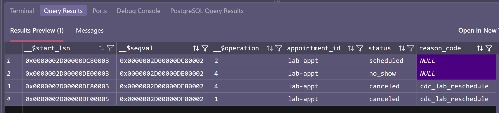

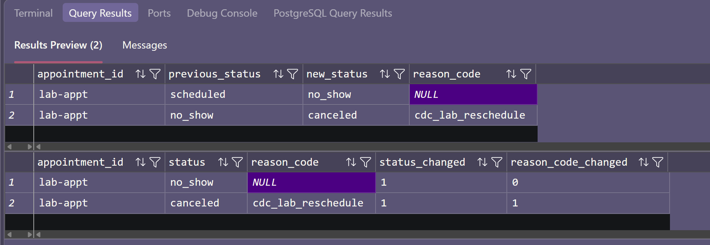

</details>

## 12. Troubleshooting

### Startup and initialization

If initialization waits or fails, check logs, resolve the error, and rerun:

```bash
dc() { docker compose -f docker/database-capture/compose.yaml "$@"; }
dc ps sqlserver
dc logs --tail=100 sqlserver
dc run --rm sqlserver-init
```

Host clients use `localhost,1435`; Docker clients use `sqlserver:1433`.
In a Codespace, `localhost` refers to the Codespace.

[Back to Step 1](#1-connect-to-the-container-database)

### CDC Enablement Repair

For missing CDC objects or error `22830` / deadlock `1205`, rerun
`dc run --rm sqlserver-init`. It retries CDC enablement and preserves seeded rows.
For manual repair, connect as `sa` and run:

```sql
USE NorthstarSource;
GO

IF DB_ID(N'NorthstarSource') IS NULL
    THROW 51020, 'NorthstarSource does not exist. Run sqlserver-init first to create and seed it.', 1;
GO

IF NOT EXISTS (
    SELECT 1 FROM sys.databases
    WHERE name = N'NorthstarSource' AND is_cdc_enabled = 1
)
BEGIN
    EXEC sys.sp_cdc_enable_db;
END
GO

IF NOT EXISTS (
    SELECT 1
    FROM cdc.change_tables
    WHERE source_object_id = OBJECT_ID(N'dbo.appointments')
)
BEGIN
    EXEC sys.sp_cdc_enable_table
        @source_schema = N'dbo',
        @source_name = N'appointments',
        @capture_instance = N'app_appointments',
        @role_name = NULL,
        @supports_net_changes = 0;
END
GO

EXEC sys.sp_cdc_help_change_data_capture
    @source_schema = N'dbo', @source_name = N'appointments';
EXEC sys.sp_cdc_help_jobs;
GO
```

Agent must show `Running`:

```sql
SELECT servicename, status_desc
FROM sys.dm_server_services
WHERE servicename LIKE N'SQL Server Agent%';
GO
```

[Back to Step 3](#3-verify-cdc)

### Capture failures

Inspect capture jobs, errors, and the retained LSN range:

```sql
EXEC sys.sp_cdc_help_jobs;
SELECT TOP (10) * FROM sys.dm_cdc_log_scan_sessions ORDER BY session_id DESC;
SELECT TOP (20) * FROM sys.dm_cdc_errors ORDER BY entry_time DESC;
SELECT sys.fn_cdc_get_min_lsn(N'app_appointments') AS oldest_available_lsn,
       sys.fn_cdc_get_max_lsn() AS latest_captured_lsn;
SELECT name, log_reuse_wait_desc FROM sys.databases WHERE database_id = DB_ID();
GO
```

<details>
<summary>Expected capture-job results</summary>

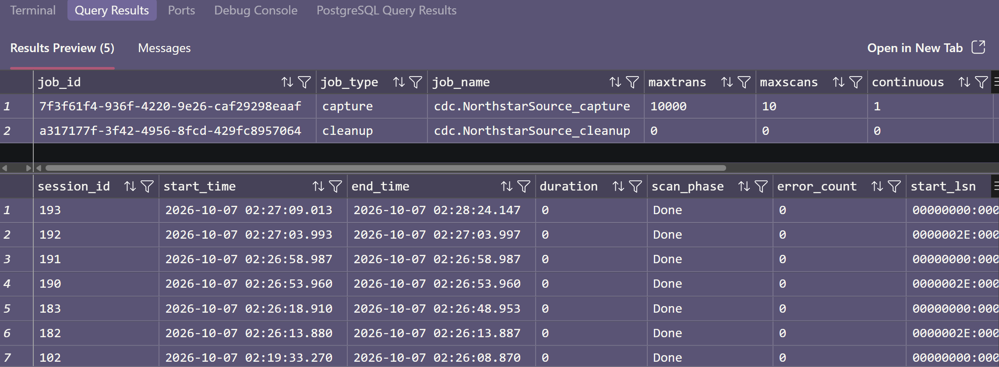

</details>

[Back to Step 6](#6-wait-for-capture)

### Troubleshooting

| Issue | Check | Return to Step |
| --- | --- | --- |
| <a id="fix-initializer-exits-nonzero"></a>Initializer exits nonzero | Inspect its command output and `dc logs sqlserver`; resolve the error before continuing. | [2](#2-verify-the-seed), [3](#3-verify-cdc) |
| <a id="fix-host-connection-fails"></a>Host connection fails | Use port `1435`; container-to-container SQL clients use `sqlserver:1433`. | [1](#1-connect-to-the-container-database) |
| <a id="fix-cdc-rows-never-arrive"></a>CDC rows never arrive | Confirm commits, Agent status, capture jobs, and `sys.dm_cdc_errors`. | [6](#6-wait-for-capture), [8](#8-verify-rollback) |
| <a id="fix-capture-job-stopped"></a>Capture job stopped | Resolve the error, then use `EXEC sys.sp_cdc_start_job @job_type = N'capture';` only if stopped. | [3](#3-verify-cdc) |
| <a id="fix-error-313"></a>Error 313 | Check LSN endpoints against the currently retained interval. | [6](#6-wait-for-capture), [9](#9-read-the-next-checkpoint-window) |
| <a id="fix-missing-temporary-tables"></a>Missing temporary tables | The SQL session changed. Start the exercise again in a single session. | [1](#1-connect-to-the-container-database), [5](#5-generate-committed-changes), [6](#6-wait-for-capture), [7](#7-read-the-changes), [8](#8-verify-rollback), [9](#9-read-the-next-checkpoint-window), [10](#10-restore-and-finish) |
| <a id="fix-net-changes-function-missing"></a>Net-changes function missing | Expected: the initializer sets `@supports_net_changes = 0`. | [3](#3-verify-cdc) |

Disabling CDC removes captured history. An expired checkpoint requires a new
coordinated snapshot; changing it to the minimum LSN can skip changes.
