# PostgreSQL CDC: capture changes from the Docker lab

Capture seeded appointment changes through Debezium Server's HTTP sink. Assume
the PostgreSQL 18 and receiver containers are running, `northstar_cdc_lab` is
seeded, and the Debezium image is already available. No Kafka is required.

This walkthrough uses the existing `change-data-capture-oreilly-live` project on
host port `15432`. SQL Server can keep running in the same project. For container
setup, see the [database capture stack](../../docker/database-capture/README.md).
After the core lab, the [bonus exercise](BONUS.md) connects the web app to a
separate `northstar_app` database.

## 1. Connect to the container database

Run Docker commands from the repository root in any host terminal. Use Terminal
A for Docker commands, a PostgreSQL client for SQL, and Terminal C for the
optional Python app.

<details>
<summary>Option 1: psql</summary>

Run this in Terminal B:

```text
docker compose -f docker/database-capture/compose.yaml exec postgres psql -U postgres -d northstar_cdc_lab -v ON_ERROR_STOP=1
```

Run SQL inside `psql`; `\connect` switches databases and `\q` exits.

</details>

<details>
<summary>Option 2: VS Code PostgreSQL extension</summary>

Install the [PostgreSQL extension](https://marketplace.visualstudio.com/items?itemName=ms-ossdata.vscode-pgsql)
(`ms-ossdata.vscode-pgsql`). Add a connection with:

| Setting | Value |
| --- | --- |
| Host | `localhost` |
| Port | `15432` |
| User | `postgres` |
| Password | `postgres-lab-only` |
| Database | `northstar_cdc_lab` |

Open a query connected to `northstar_cdc_lab`. Use a new query connection when a
later step asks you to switch databases.

</details>

<details>
<summary>Connection screenshots</summary>

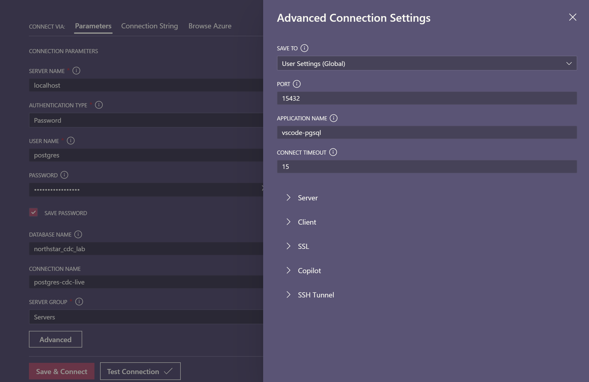

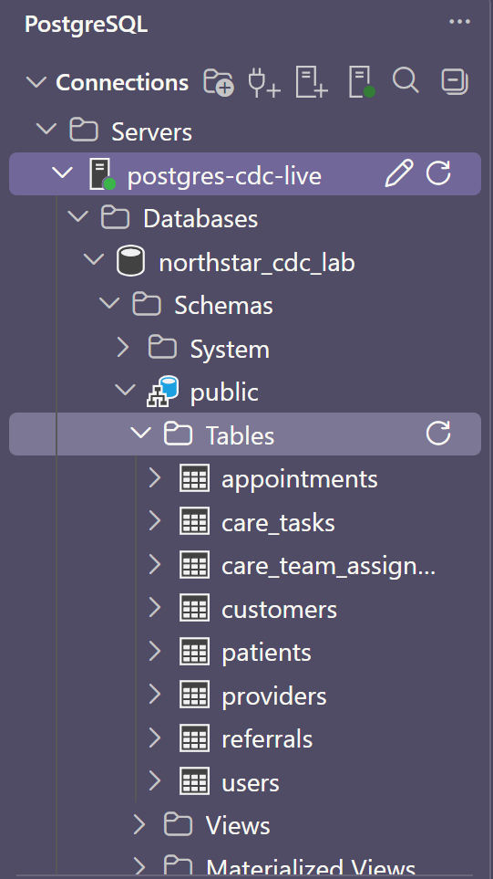

</details>

Run in the selected SQL client:

```sql
SELECT version(), current_database(), current_user;
SHOW wal_level;
SHOW max_replication_slots;
SHOW max_wal_senders;
SHOW max_slot_wal_keep_size;
SET TIME ZONE 'UTC';
```

Expect PostgreSQL 18, database `northstar_cdc_lab`, `wal_level = logical`,
10 slots/senders, and `max_slot_wal_keep_size = 1GB`. For errors, see
[Troubleshooting](#connection-or-capture-failures).

<details>
<summary>Expected connection results</summary>

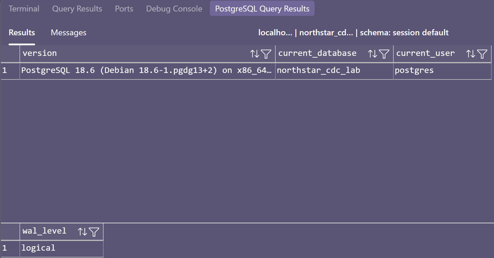

</details>

## 2. Verify the seed

```sql
SELECT count(*) AS users FROM public.users;
SELECT count(*) AS providers FROM public.providers;
SELECT count(*) AS assignments FROM public.care_team_assignments;
SELECT * FROM public.patients ORDER BY patient_id;
SELECT appointment_id, patient_id, provider_id, status, reason_code
FROM public.appointments ORDER BY appointment_id;
SELECT referral_id, patient_id, status FROM public.referrals ORDER BY referral_id;
SELECT task_id, patient_id, task_type, status FROM public.care_tasks ORDER BY task_id;
```

Expect 7 users, 2 providers, 10 patients, 10 assignments, 10 appointments,
6 referrals, and 10 care tasks, matching the app's [seed](../../app/seed.py).

<details>
<summary>Expected seed results</summary>

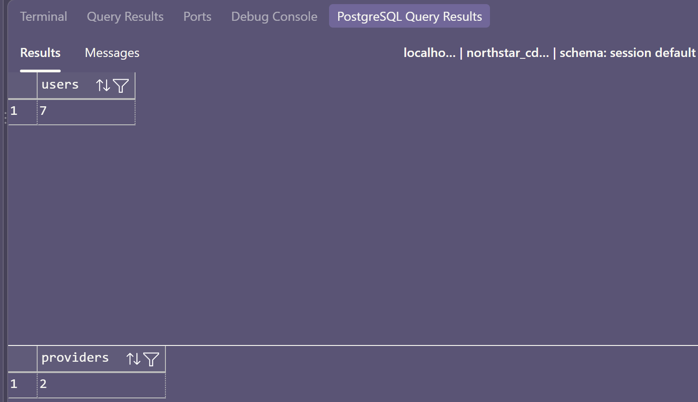

</details>

## 3. Verify CDC

```sql
SELECT pubname, schemaname, tablename
FROM pg_publication_tables WHERE pubname = 'northstar_publication';
SELECT relname, relreplident
FROM pg_class WHERE oid = 'public.appointments'::regclass;
SELECT rolname, rolreplication, rolsuper FROM pg_roles WHERE rolname = 'debezium';
```

Expect only `public.appointments` in `northstar_publication`, replica identity
`f` (full before-images), and `debezium` with replication enabled but not superuser.
If missing, use [Troubleshooting](#connection-or-capture-failures).

<details>
<summary>Expected CDC configuration</summary>

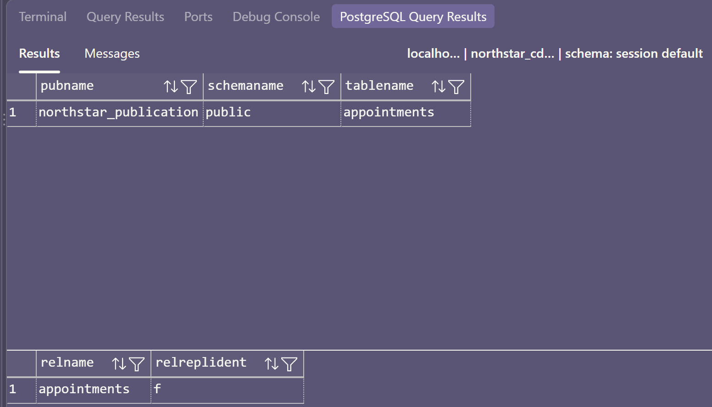

</details>

## 4. Start capture and read the snapshot

From the repository root in a host terminal:

```text
docker compose -f docker/database-capture/compose.yaml up -d --pull never --no-build debezium
docker compose -f docker/database-capture/compose.yaml logs --tail=100 debezium
docker compose -f docker/database-capture/compose.yaml exec -T cdc-receiver cat ../data/events.jsonl
```


On a clean attendee setup, expect exactly ten appointment events with `op = "r"`,
`before = null`, and a seeded row in `after`. If the receiver only reports that
it is listening, Debezium resumed from a saved offset. Continue to Step 5 for a
normal resume, or use [Reset the Step 4 snapshot](#reset-the-step-4-snapshot) to
reproduce the initial snapshot. Watch new events with:

```text
docker compose -f docker/database-capture/compose.yaml logs -f cdc-receiver
```

Press `Ctrl+C` to stop following the logs without stopping the container. For
capture errors, see [Troubleshooting](#connection-or-capture-failures).

Check the slot in your SQL client:

```sql
SELECT slot_name, plugin, slot_type, database, active,
       restart_lsn, confirmed_flush_lsn
FROM pg_replication_slots WHERE slot_name = 'northstar_http_slot';
```

Expect `northstar_http_slot` with plugin `pgoutput` and `active = true`.

[Capture failure](#connection-or-capture-failures) · [Repeat the snapshot](#reset-the-step-4-snapshot)

<details>
<summary>Expected snapshot and replication slot</summary>

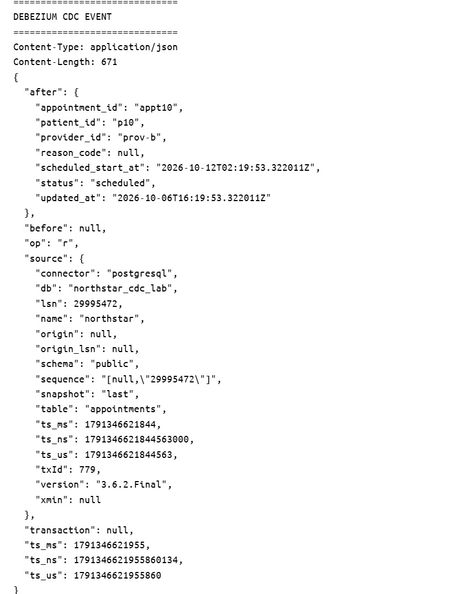

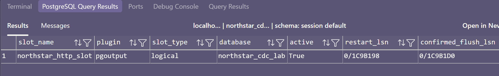

</details>

## 5. Generate committed changes

Run once in your SQL client after verifying capture:

```sql
BEGIN;
INSERT INTO public.appointments
    (appointment_id, patient_id, provider_id, scheduled_start_at, status, updated_at)
VALUES
    ('lab-appt', 'p1', 'prov-a', clock_timestamp() + interval '1 day',
     'scheduled', clock_timestamp());
COMMIT;

BEGIN;
UPDATE public.appointments
SET status = 'no_show', reason_code = 'patient_absent', updated_at = clock_timestamp()
WHERE appointment_id = 'appt1';
COMMIT;

BEGIN;
UPDATE public.appointments
SET status = 'canceled', reason_code = 'rescheduled_by_reception',
    updated_at = clock_timestamp()
WHERE appointment_id = 'appt1';
COMMIT;

BEGIN;
DELETE FROM public.appointments WHERE appointment_id = 'lab-appt';
COMMIT;

SELECT appointment_id, patient_id, status FROM public.appointments ORDER BY appointment_id;
```

Expect 10 appointments: `appt1` is canceled, `appt2` is still no-show, and
`lab-appt` is deleted.

<details>
<summary>Expected committed-change results</summary>

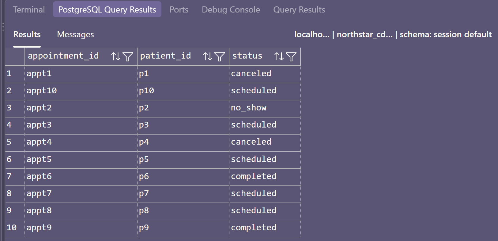

</details>

## 6. Read the changes

From the repository root in a host terminal:

```text
docker compose -f docker/database-capture/compose.yaml exec -T cdc-receiver cat ../data/events.jsonl
```

The journal prints one JSON event per line and survives receiver recreation. In
Docker Desktop, you can also open the `cdc-receiver` logs and search for
`"op": "r"`, `"op": "c"`, `"op": "u"`, or `"op": "d"`.

For a fresh run without retries, wait until fourteen events are present:

| Count | Appointment | `op` | Expected images |
| --- | --- | --- | --- |
| 10 | `appt1`–`appt10` | `r` | Initial snapshot; populated `after` |
| 1 | `lab-appt` | `c` | Null `before`; inserted row in `after` |
| 1 | `appt1` | `u` | `completed` before, `no_show` after |
| 1 | `appt1` | `u` | `no_show` before, `canceled` after |
| 1 | `lab-appt` | `d` | Deleted row in `before`; null `after` |

<details>
<summary>Expected captured changes</summary>

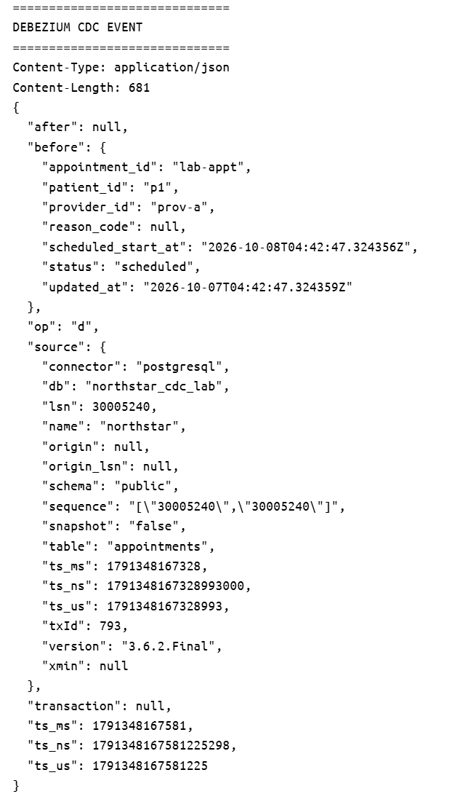

</details>

## 7. Verify rollback

In your SQL client:

```sql
BEGIN;
INSERT INTO public.appointments
    (appointment_id, patient_id, provider_id, scheduled_start_at, status, updated_at)
VALUES
    ('appt_rollback', 'p2', 'prov-a', clock_timestamp() + interval '2 days',
     'scheduled', clock_timestamp());
SELECT * FROM public.appointments WHERE appointment_id = 'appt_rollback';
ROLLBACK;
SELECT * FROM public.appointments WHERE appointment_id = 'appt_rollback';

-- This later committed marker proves capture progressed past the experiment.
UPDATE public.appointments
SET status = 'completed', updated_at = clock_timestamp()
WHERE appointment_id = 'appt2';
```

From the repository root in a host terminal:

```text
docker compose -f docker/database-capture/compose.yaml exec -T cdc-receiver cat ../data/events.jsonl
```

Search the output for `appt2` and `appt_rollback`. Wait for
`appt2 = completed`. Expect 15 events in a clean run and none for
`appt_rollback`.

<details>
<summary>Expected rollback results</summary>

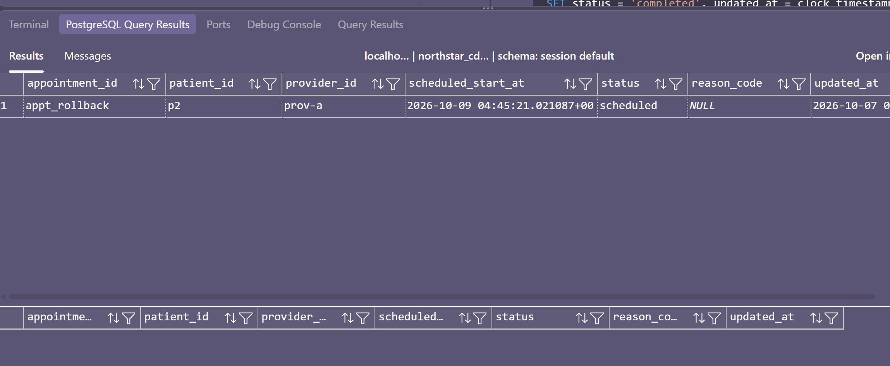

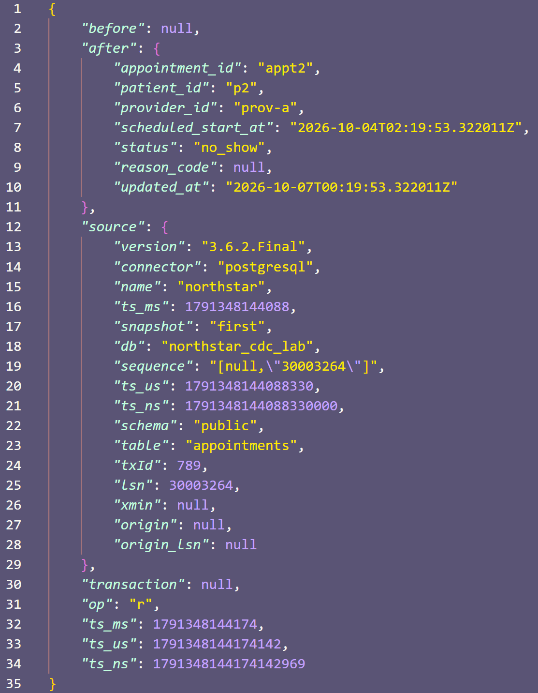

</details>

## 8. Verify recovery

From the repository root in a host terminal, stop only Debezium:

```text
docker compose -f docker/database-capture/compose.yaml stop debezium
```

In your SQL client:

```sql
SELECT slot_name, active FROM pg_replication_slots
WHERE slot_name = 'northstar_http_slot';

UPDATE public.appointments
SET status = 'canceled', reason_code = 'capture_outage_test',
    updated_at = clock_timestamp()
WHERE appointment_id = 'appt4';
```

Expect the slot to be inactive and the source row to change. Restart capture and
inspect the receiver:

```text
docker compose -f docker/database-capture/compose.yaml start debezium
docker compose -f docker/database-capture/compose.yaml logs --tail=80 debezium
docker compose -f docker/database-capture/compose.yaml exec -T cdc-receiver cat ../data/events.jsonl
```

Search for `capture_outage_test`. Expect the saved `appt4` update to arrive after
restart. Keep the slot and offsets together; restarts can redeliver events.

[Capture failure](#connection-or-capture-failures)

<details>
<summary>Expected recovery results</summary>

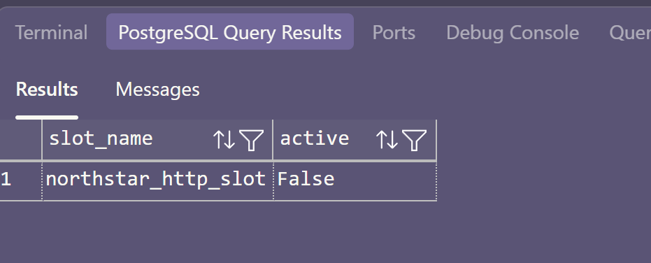

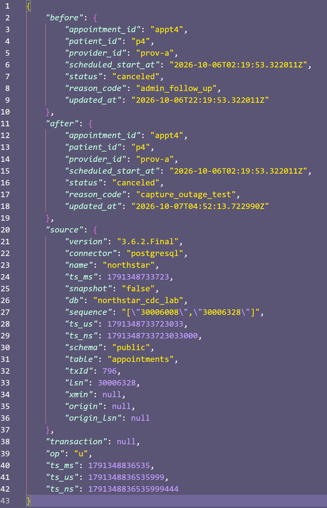

</details>

## 9. Finish

Continue to the [Python bonus exercise](BONUS.md) with PostgreSQL running, or
stop here.

To stop all services while retaining database data, connector offsets, and the
journal:

```text
docker compose -f docker/database-capture/compose.yaml --profile app-capture stop
```

This preserves database data, connector offsets, and the event journal.

## 10. Resources

- [Compose configuration](../../docker/database-capture/compose.yaml)
- [Lab connector settings](../../docker/database-capture/debezium/application.properties)
- [Debezium Server HTTP sink](https://debezium.io/documentation/reference/3.4/operations/debezium-server.html#_http)
- [Debezium PostgreSQL 18 support](https://debezium.io/releases/3.4/)
- [PostgreSQL container data layout](https://hub.docker.com/_/postgres)
- [Logical replication settings](https://www.postgresql.org/docs/18/logical-replication-config.html)
- [Logical replication security](https://www.postgresql.org/docs/18/logical-replication-security.html)
- [Publications](https://www.postgresql.org/docs/18/sql-createpublication.html)
- [Replica identity](https://www.postgresql.org/docs/18/sql-altertable.html#SQL-ALTERTABLE-REPLICA-IDENTITY)
- [Debezium offsets](https://debezium.io/documentation/reference/3.4/configuration/storage.html)
- [Snapshot behavior](https://debezium.io/documentation/reference/3.4/connectors/postgresql.html#postgresql-snapshots)
- [Change-event fields](https://debezium.io/documentation/reference/3.4/connectors/postgresql.html#postgresql-change-events)
- [Logical decoding](https://www.postgresql.org/docs/18/logicaldecoding-explanation.html)
- [Debezium recovery](https://debezium.io/documentation/reference/3.4/development/engine.html)
- [Replication slots](https://www.postgresql.org/docs/18/view-pg-replication-slots.html)
- [WAL retention settings](https://www.postgresql.org/docs/18/runtime-config-replication.html#GUC-MAX-SLOT-WAL-KEEP-SIZE)
- [SQLAlchemy Psycopg support](https://docs.sqlalchemy.org/en/20/dialects/postgresql.html#module-sqlalchemy.dialects.postgresql.psycopg)
- [Optional Kafka extension](../extensions/kafka.md)

## 11. Troubleshooting

### Connection or capture failures

From the repository root in a host terminal:

```text
docker compose -f docker/database-capture/compose.yaml --profile app-capture ps -a
docker compose -f docker/database-capture/compose.yaml logs --tail=100 postgres debezium debezium-app cdc-receiver
```

If the existing database or receiver container is stopped, use
`docker compose -f docker/database-capture/compose.yaml start postgres cdc-receiver`.
Verify the seed and publication before starting capture. For missing containers
or images, use the linked stack setup guide.

| Symptom | Check |
| --- | --- |
| Wrong database or port | This project uses `northstar_cdc_lab` on host port `15432`. |
| No events | Check Debezium/receiver logs and publication membership. |
| Authentication failure | Verify credentials, replication permission, schema `USAGE`, and table `SELECT`. |
| Publication missing | Check step 3; the supplied seed creates it. Automatic creation is disabled. |
| Before values missing | Verify replica identity is `FULL`. |
| HTTP delivery failed | Restore receiver health, then restart capture. |
| Offset file cannot be written | Check data-volume permissions for the image's non-root user. |
| Slot already active | Find the existing reader; each connector needs its own slot. |
| WAL removed/slot invalidated | Recovery needs a new snapshot and matching checkpoint. Deleting offsets alone is not recovery. |
| Repeated entries or no new snapshot | Existing journals retain events; normal restarts resume from offsets. |

[Back to Step 1](#1-connect-to-the-container-database) · [Back to Step 4](#4-start-capture-and-read-the-snapshot)

### Retention checks

In your SQL client:

```sql
SELECT slot_name, active, restart_lsn, confirmed_flush_lsn, wal_status,
       pg_size_pretty(pg_wal_lsn_diff(pg_current_wal_lsn(), restart_lsn)::bigint)
           AS wal_distance_from_restart,
       safe_wal_size, invalidation_reason
FROM pg_replication_slots WHERE slot_name = 'northstar_http_slot';

SELECT application_name, state, sent_lsn, write_lsn, flush_lsn
FROM pg_stat_replication;
```

Keep slots and offsets together. Do not consume or advance Debezium's slot with
another client. The `1GB` retention limit can invalidate a lagging slot.

[Back to Step 4](#4-start-capture-and-read-the-snapshot) · [Back to Step 8](#8-verify-recovery)

### Reset the Step 4 snapshot

Use this only to repeat Step 4. It preserves PostgreSQL and SQL Server data while
resetting the PostgreSQL connector's slot and offsets:

```text
docker compose -f docker/database-capture/compose.yaml stop debezium
docker compose -f docker/database-capture/compose.yaml rm -f debezium
docker compose -f docker/database-capture/compose.yaml exec -T postgres psql -U postgres -d northstar_cdc_lab -c "SELECT pg_drop_replication_slot('northstar_http_slot') WHERE EXISTS (SELECT 1 FROM pg_replication_slots WHERE slot_name = 'northstar_http_slot');"
docker compose -f docker/database-capture/compose.yaml exec -T cdc-receiver python -c "open('../data/events.jsonl', 'w').close()"
docker volume rm change-data-capture-oreilly-live_debezium-offsets
docker compose -f docker/database-capture/compose.yaml up -d --pull never --no-build debezium
docker compose -f docker/database-capture/compose.yaml exec -T cdc-receiver cat ../data/events.jsonl
```

Expect ten `op = "r"` events. [Return to Step 4](#4-start-capture-and-read-the-snapshot).

### Reset the disposable lab

For a complete reset, stop Uvicorn, close the SQL client, and follow the stack setup guide
after running:

```text
docker compose -f docker/database-capture/compose.yaml --profile app-capture down --volumes
```

This deletes both databases, both connector offset volumes, and the journal.

[Back to Step 9](#9-finish)
